```{r setup-background}
path_fig <- "fig/background/"
fs::dir_create(path_fig)
knitr::opts_chunk$set(fig.path = path_fig, dev = "png")
```

# Background

## Project Location

The study area primarily focuses on the Neexdzii Kwah (Upper Bulkley River), which is located upstream of the confluence of the Widzin Kwah (Morice River) and the Neexdzii Kwah rivers (Figure \@ref(fig:overview-map)).  Although this area is the initial focus of activities, the overall area for project activities can include anywhere within the boundaries of the Widzin Kwah Water Sustainability Project.  The boundaries of the Widzin Kwah Water Sustainability Project include not only the Neexdzii Kwah but also the entire drainage area of Widzin Kwah (Morice River) as well as the small portion of the Bulkley River downstream of the Morice River confluence to just north of Dockrill Creek [@WidzinKwahWaterSustainabilityProject]. 

```{r overview-map, fig.cap = 'Overview map of Neexdzii Kwah Study Area',eval=T}
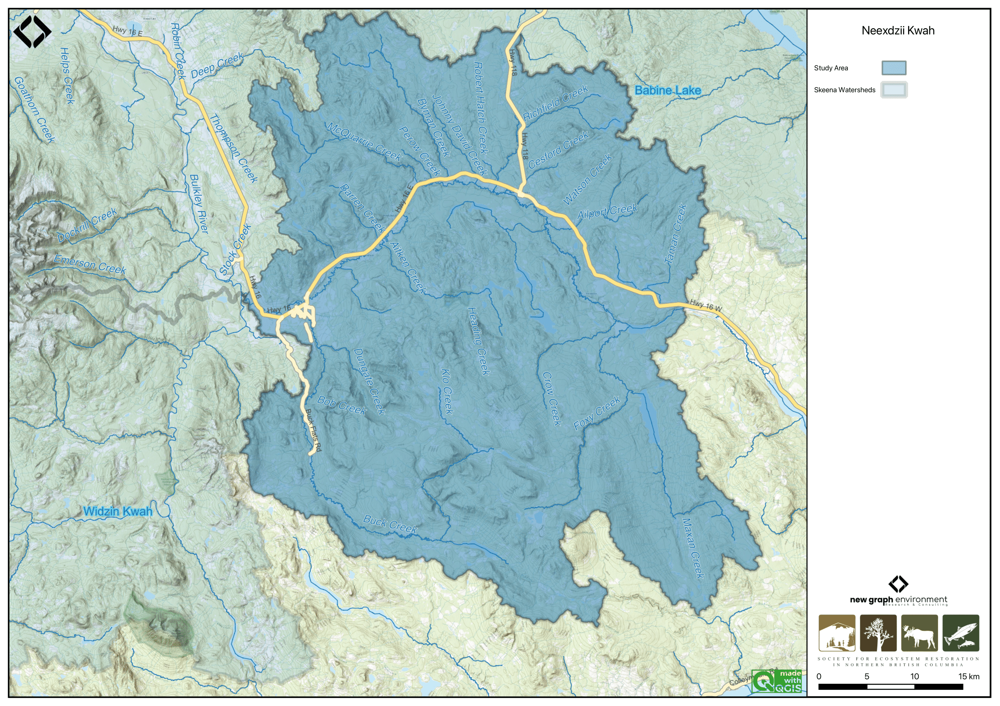
```


### Neexdzii Kwah (Upper Bulkley River)
```{r area-bulk, eval=FALSE}
fwapgr::fwa_watershed_at_measure(360873822, 164920) %>% mutate(area_km2 = round(area_ha/100, 1)) %>% pull(area_km2)
```


The Neexdzii Kwah (Upper Bulkley River) is an 8th order stream that drains an area of 2320km^2^ in a generally northerly direction from Bulkley Lake on the Nechako Plateau to its confluence with the Widzin Kwah (Morice River) near Houston [@WidzinKwahWaterSustainabilityProject]. It has a mean annual discharge of `r round(fasstr::calc_longterm_mean(station_number = "08EE003")$LTMAD,1)` m^3^/s at station 08EE003 located near Houston. The hydrograph peaks around May - June during the spring freshet with additional peaks related to significant rain events (Figure \@ref(fig:hydrograph-fasstr1)). Highway 16 and the CN Railroad parallel the upper Bulkley River and pass through the towns of Topley and Houston.

```{r, hydrometric-get-stations, eval= FALSE}
hydat_stations <- fpr::fpr_db_query(query = lfpr_dbq_clip('whse_environmental_monitoring.envcan_hydrometric_stn_sp',
'whse_basemapping.fwa_watershed_groups_poly', 'watershed_group_code', c("BULK", "MORR")))

hydat_stations_active <- hydat_stations %>% 
  dplyr::filter(station_operating_status == "ACTIVE-REALTIME")
```

```{r, hydrograph-create-01, eval=FALSE}
lfpr_create_hydrograph("08EE003", start_year = 1980)
```


```{r hydrograph-fasstr1, fig.cap = 'Neexdzii Kwah near Houston (Station #08EE003 - Lat 54.39938 Lon -126.71941).'}
plot <- fasstr::plot_longterm_monthly_stats(
  station_number = "08EE003",
  ignore_missing = TRUE,
  add_year = 2023
)

print(plot$`Long-term_Monthly_Statistics`)
```

```{r hydrograph1, fig.cap = 'Bulkley River Near Houston (Station #08EE003 - Lat 54.39938 Lon -126.71941). Available mean daily discharge data from 1980 to 2022.', eval=F}
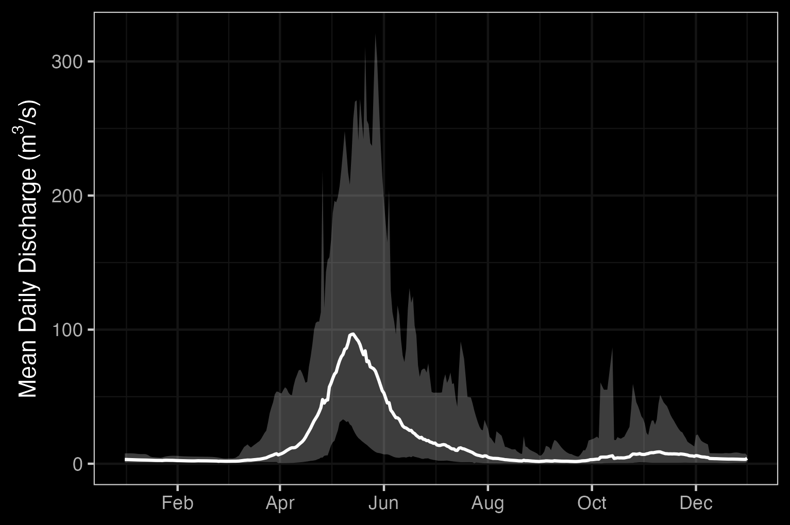
```

```{r hydrology-stats1, fig.cap = "Bulkley River Near Houston (Station #08EE003 - Lat 54.39938 Lon -126.71941). Available daily discharge data from 1980 to 2022.", eval=FALSE}
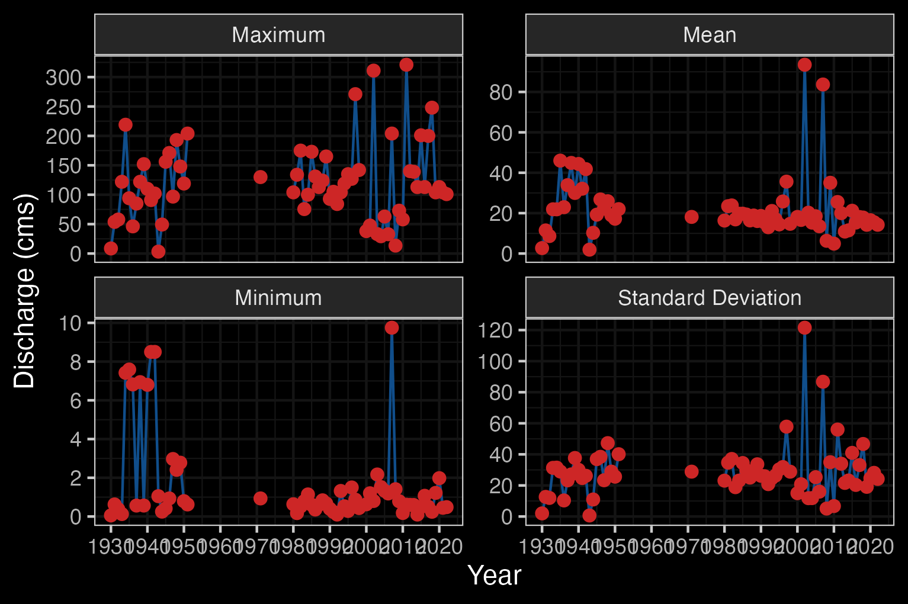
```


### Buck Creek

```{r area-buck, eval = FALSE}
fwapgr::fwa_watershed_at_measure(360886221) %>% mutate(area_km2 = round(area_ha/100, 1)) %>% pull(area_km2)
```


Buck Creek is a 5th order stream which enters Neexdzii Kwah just upstream of the Wedzin Kwa / Neexdzii Kwah (Morice/Bulkley) confluence adjacent to Houston.  The watershed drains an area of 567km^2^. Buck Creek is one of the main tributaries to the Neexdzii Kwah and has a mean annual discharge of `r round(fasstr::calc_longterm_mean(station_number = "08EE013")$LTMAD,1)` m^3^/s at station 08EE013 located near the Houston Medical Centre approximately 1 km upstream of the mouth [@westcott2022UpperBulkley]. Flows from Buck Creek account for just under 1/3 of the total flows in Neexdzii Kwah. The hydrograph for Buck Creek shows a similar pattern to Neexdzii Kwah with peak flows in May - June (Figure \@ref(fig:hydrograph-fasstr2)).


```{r hydrograph-fasstr2, fig.cap = 'Buck Creek at the confluence with the Neexdzii Kwah (Station #08EE013 - Lat 54.39608 Lon -126.65024).'}
plot <- fasstr::plot_longterm_monthly_stats(station_number = "08EE013",
                            ignore_missing = TRUE,
                            add_year = 2023) 
print(plot$`Long-term_Monthly_Statistics`)
```


```{r, hydrograph-create-02, eval=F}
lfpr_create_hydrograph("08EE013")
```

```{r hydrograph2, fig.cap = 'Buck Creek at the confluence with the Neexdzii Kwah (Station #08EE013 - Lat 54.39608 Lon -126.65024). Available mean daily discharge data from 1973 to 2022.', eval=F}
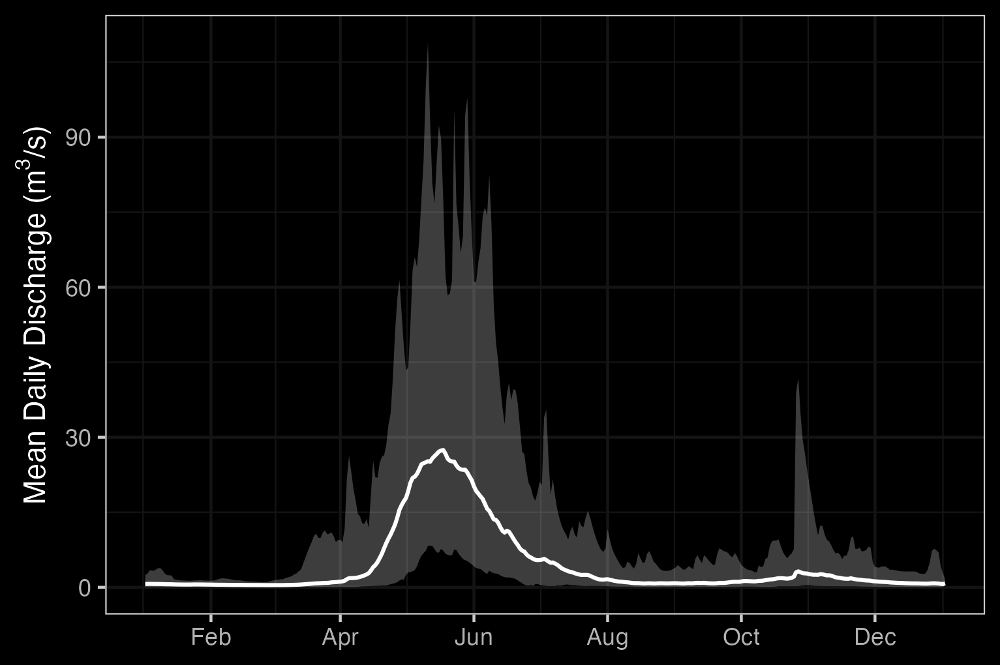
```

```{r hydrology-stats2, fig.cap = "Buck Creek at the confluence with the Neexdzii Kwah (Station #08EE013 - Lat 54.39608 Lon -126.65024). Available daily discharge data from 1973 to 2022.", eval = FALSE}
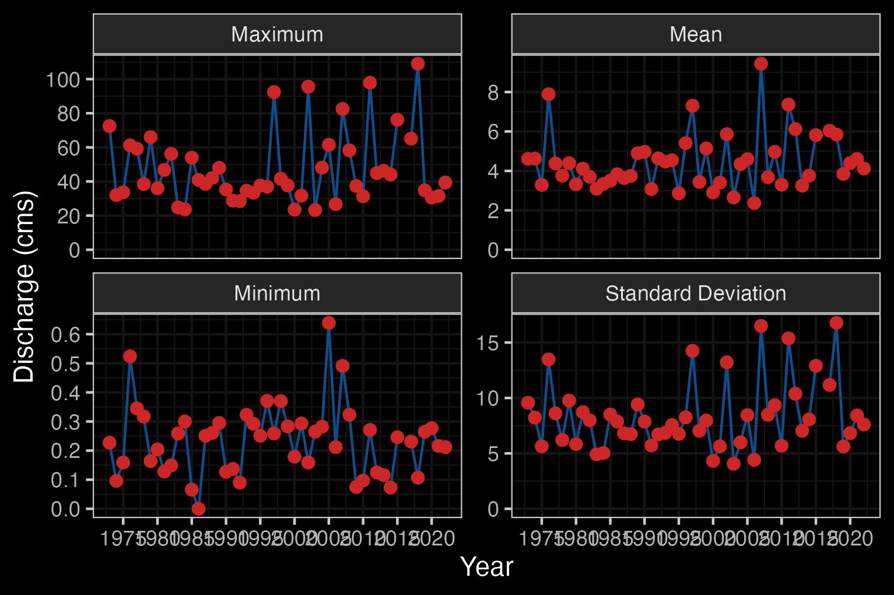
```


```{r hydrometric-get-3, eval = FALSE}
# McQuarrie Creek is a 5th order stream that flows into the Upper Bulkley River \~20 km upstream of Houston, and drains an area of `r fwapgr::fwa_watershed_at_measure(360875378) %>% mutate(area_km2 = round(area_ha/100, 1)) %>% pull(area_km2)` km^2^. There is one hydrometric station on McQuarrie Creek deployed by the BC Ministry of Forests, Land, Natural Resource Operations and Rural Development Groundwater Program (FLNRORD) which was was active from 2016-2018 but has very few data [@westcott2022UpperBulkley]. An estimate of mean annual discharge for the two years of available data is `r round(fasstr::calc_longterm_mean(mq_clean),1)` m^3^/s at station 08EE0002 located near the mouth of the creek. Based of the limited data, the hydrograph for McQuarrie Creek during this time period peaks rapidly in May and again in the winter (Figures \@ref(fig:hydrograph3)).
### McQuarrie Creek
#McQuarrie Creek, station number 08EE0002, but station not part of hydat database
mq <- read.csv("data/hydrometric/DataSetExport-Discharge.Logger@08EE0002-20240308164919.csv")

mq_clean <- mq %>%
  janitor::row_to_names(2) %>%
  janitor::clean_names() %>%
  select(-event_timestamp_utc_08_00)%>%
  rename(Value = value_m_3_s) %>%
  mutate(Value = as.numeric(Value)) %>%
  mutate(timestamp_utc_08_00 = lubridate::ymd_hms(timestamp_utc_08_00)) %>%
  mutate(Date = lubridate::date(timestamp_utc_08_00)) %>%
  mutate(time = format(timestamp_utc_08_00, "%H:%M:%S"))

start_year <- mq_clean$Date %>% min() %>% lubridate::year()
end_year <- mq_clean$Date %>% max() %>% lubridate::year()
```

```{r, hydrometric-tidy3, eval = FALSE}
#Manually creating hydrograph for McQuarrie Creek, station 08EE0002, because station not part of hydat database.

flow <- mq_clean %>%
  dplyr::mutate(day_of_year = yday(Date)) %>%
  dplyr::group_by(day_of_year) %>%
  dplyr::summarise(daily_ave = mean(Value, na.rm=TRUE),
                   daily_sd = sd(Value, na.rm = TRUE),
                   max = max(Value, na.rm = TRUE),
                   min = min(Value, na.rm = TRUE)) %>%
  dplyr::mutate(Date = as.Date(day_of_year))

plot <- ggplot2::ggplot()+
  ggplot2::geom_ribbon(data = flow, aes(x = Date, ymax = max,
                                        ymin = min),
                       alpha = 0.3, linetype = 1)+
  ggplot2::scale_x_date(date_labels = "%b", date_breaks = "2 month") +
  ggplot2::labs(x = NULL, y = expression(paste("Mean Daily Discharge (", m^3, "/s)", sep="")))+
  ggdark::dark_theme_bw() +
  ggplot2::geom_line(data = flow, aes(x = Date, y = daily_ave),
                     linetype = 1, linewidth = 0.7) +
  ggplot2::scale_colour_manual(values = c("grey10", "red"))
plot

ggplot2::ggsave(plot = plot, file=paste0("fig/hydrograph_", "08EE0002", ".png"),
                h=3.4, w=5.11, units="in", dpi=300)
```

```{r hydrograph3, fig.cap = 'Hydrograph for McQuarrie Creek above Hwy 16 Culvert (Station #08EE0002 - Lat 54.51572 Lon -126.46606). Available mean daily discharge data from 2016 to 2018).', eval=FALSE}
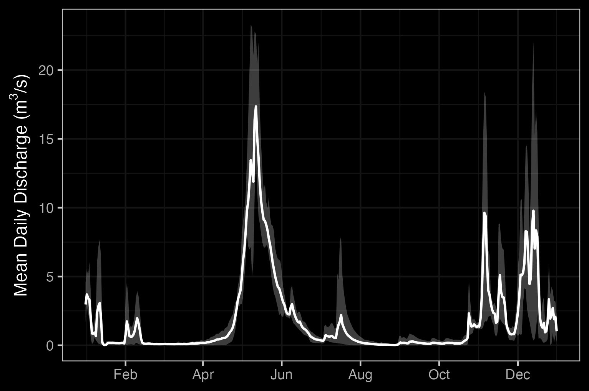
```

```{r}
### Widzin Kwah (Morice River)

# The Widzin Kwah (Morice River) watershed drains `r fwapgr::fwa_watershed_at_measure(360885316) %>% mutate(area_km2 = round(area_ha/100, 1)) %>% pull(area_km2)` km^2^ of Coast Mountains and Interior Plateau in a generally south-eastern direction. The Morice River is an 8th order stream that flows approximatley 80km from Widzin Bin (Morice Lake) to the confluence with the upper Bulkley River just north of Houston. Major tributaries include the Nanika River, the Atna River, Gosnell Creek and the Thautil River. There area numerous large lakes situated on the south side of the watershed including Morice Lake, McBride Lake, Stepp Lake, Nanika Lake, Kid Price Lake, Owen Lake and others. There is one active hydrometric station on the mainstem of the Morice River near the outlet of Morice Lake and one historic station that was located at the mouth of the river near Houston that gathered data in 1971 only [@canada2010NationalWater]. An estimate of mean annual discharge for the one year of data available for the Morice near it's confluence with the Bulkley River is `r round(fasstr::calc_longterm_mean(station_number = "08ED003")$LTMAD,1)` m^3^/s. Mean annual discharge is estimated at `r round(fasstr::calc_longterm_mean(station_number = "08ED002")$LTMAD,1)` m^3^/s at station 08ED002 located near the outlet of Morice Lake. Flow patterns are typical of high elevation watersheds influenced by coastal weather patterns which receive large amounts of winter precipitation as snow in the winter and large precipitation events in the fall. This leads to peak levels of discharge during snowmelt, typically from May to July with isolated high flows related to rain and rain on snow events common in the fall (Figures \@ref(fig:hydrograph4) - \@ref(fig:hydrology-stats4)).
# 
# ```{r, eval=TRUE}
# lfpr_create_hydrograph("08ED002")
```

```{r hydrograph4, fig.cap = " Outlet of Morice Lake (Station #08ED002 - Lat 54.11683 Lon -127.42658). Available mean daily discharge data from 1961 to 2022.", eval = FALSE}

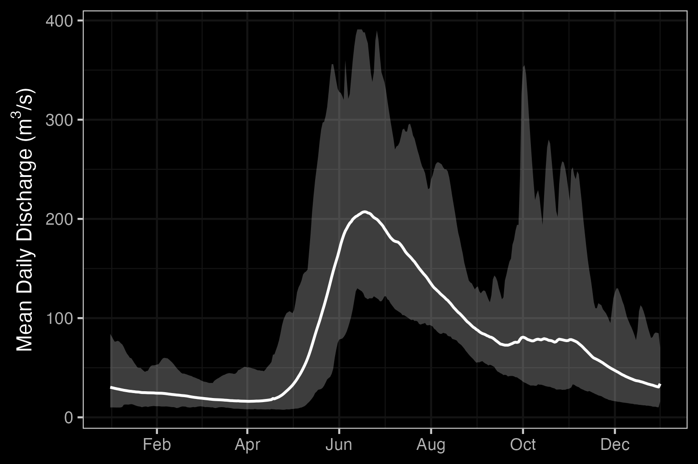
```

```{r hydrology-stats4, fig.cap = " Outlet of Morice Lake (Station #08ED002 - Lat 54.11683 Lon -127.42658). Available daily discharge data from 1961 to 2022.", eval = FALSE}

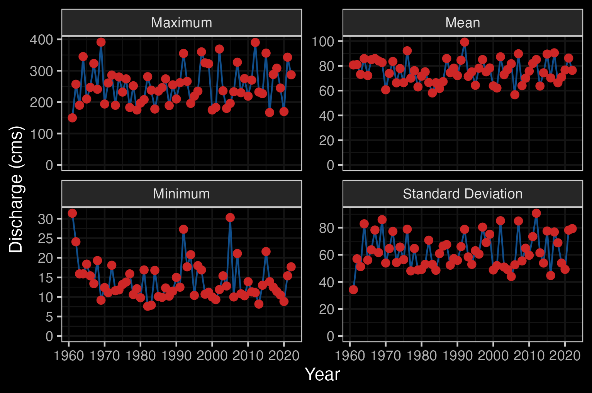
```

### Climate Anomalies

To provide regional climate context, we used a custom fork of the [BC Climate Anomaly App](https://www.bcclimateanomaly.ca) to generate precipitation, mean temperature, and soil moisture anomaly plots for the study area [@bcgovernment2024BCclimate]. This version of the app - located [here](https://github.com/NewGraphEnvironment/bc_climate_anomaly/tree/newgraph) allows for custom spatial inputs, enabling localized summaries served through the app locally.

<br>

Anomalies are calculated relative to 1981–2010 climate normals using ERA5-Land reanalysis data, regridded to ~30 km spatial resolution [@@munozsabater2019ERA5Landhourlya]. Trend direction and significance are assessed using the Mann-Kendall test and Theil-Sen slope estimator over the 1951–present period [@bcgovernment2024BCclimate].

<br>
See [Appendix - Climate Anomaly Data](#app-climate-anomaly) for plots.


## Skeena Knowledge Trust
[The Skeena Knowledge Trust (SKT)](https://www.skeenatrust.ca/about/) serves as a centralized repository for data and information related to salmon and salmon habitat within the Skeena River watershed. To support informed decision-making, SKT provides access to a wide range of reports, datasets, and spatial information through its online platform. Data including reports, datasets, and spatial layers relevant to salmon conservation and habitat management in the region are accessible through the [SKT data portal](https://data.skeenasalmon.info).

## Water Quality
Water quality in the Neexdzi Kwah watershed has been the focus of multiple key studies, including among others - @nijman1996Waterquality, @remington_donas2000Nutrientsalgae, @oliver2020Analysis2017 and @westcott2022UpperBulkleya. The background information and resulting recommendations contained within these reports are critical for informing watershed recovery actions, as water quality has the potential to be a limiting factor for fish and fish food. This detailed documentation can also be leveraged to serve as a baseline dataset in which to compare current and future conditions. The reader is encouraged to source information directly from the aforementioned reports as the following summary has been simplified greatly.

<br>

The technical report by @nijman1996Waterquality assessed the water quality of the Bulkley River headwaters, focusing on the impacts of the Equity mine, using available data on waste discharges, water quality, streamflows, and water use. It also identified water uses requiring protection and recommended provisional water quality objectives for the headwaters and downstream sections.

<br>

@remington_donas2000Nutrientsalgae put together the analysis of a significant amount of technical data related water, sediment and periphyton samples collected from November 1997 to March 2000 by the Habitat Restoration and Salmonid Enhancement Program (Fisheries and Oceans Canada) and others. Nutrients monitored included total phosphorus (TP), soluble orthophosphorus (SRP), ammonia, nitrate, organic nitrogen and total dissolved nitrogen. Periphytic algae was measured at nine sites September 1999 by Remington Enviromnental.  Substrate composition and interstitial dissolved oxygen measurement was also conducted at three sites in the upper Bulkley River mainstem as well as one site within Maxan Creek. Reporting from the project noted that the Neexdzi Kwah watershed has easily erodible glacial-fluvial and glacial-lacustrine soils and unusually high soluble phosphorus concentrations compared to other Skeena watershed streams, making it particularly vulnerable to eutrophication from nitrogen loading linked to septic, agriculture and livestock. They recommended a long-term, cost-effective ecosystem health monitoring strategy, incorporating water quality, periphyton, and benthic invertebrate bioassessment. Monitoring nutrients and algae was highlighted as a key approach to track changes over time, assess restoration success, and identify long-term trends within the upper Bulkley River mainstem and major tributaries to better target remedial actions.


## Fisheries

### Neexdzii Kwah

Traditionally, the salmon stocks passing through and spawning in the greater Bulkley River were the principal food source for the Gitxsan and Wet’suwet’en people living there [@wilson_rabnett2007FishPassage].  Anadromous lamprey passing through and spawning in the upper Neexdzii Kwah were traditionally also an important food source for the Wet'suwet'en (@gottesfeld_rabnett2007SkeenaFish; pers comm. Mike Ridsdale, Environmental Assessment Coordinator, Office of the Wet'suwet'en).  @gottesfeld_rabnett2007SkeenaFish report sourceing information from @departmentoffisheriesandoceans1991Fishhabitat that principal spawning areas for chinook in the Neexdzii Kwah include the mainstem above and below Buck and McQuarrie Creeks, between Cesford and Watson Creeks, and the reaches upstream and downstream of Bulkley Falls.

<br>

Renowned as a world class recreational steelhead and coho fishery, the greater Bulkley River downstream of Neexdzii Kwah receives some of the heaviest angling pressure in the province. In response to longstanding angler concerns with respect to overcrowding, quality of experience and conflict amongst anglers, an Angling Management Plan was drafted for the river following the initiation of the Skeena Quality Waters Strategy process in 2006 and an extensive multi-year consultation process. The plan introduces a number of regulatory measures with the intent to provide Canadian resident anglers with quality steelhead fishing opportunities. Regulatory measures introduced with the Angling Management Plan include prohibited angling for non-guided non-resident aliens on Saturdays and Sundays, Sept 1 - Oct 31 within the Bulkley River, angling prohibited for non-guided non-resident aliens on Saturdays and Sundays, all year within the Suskwa River and angling prohibited for non-guided non-resident aliens Sept 1 - Oct 31 in the Telkwa River. The Neexdzii Kwah is considered Class II water and there is no fshing permitted upstream of the Morice/Bulkley River Confluence [@flnro2013BulkleyRiver; @flnro2013OverviewAngling; @flnrord2019FreshwaterFishing].

<br>

#### Barriers to Fish Passage

Two major natural barriers shape salmon distribution within the Neexdzii Kwah: Bulkley Falls on the mainstem and a series of falls on Buck Creek.

<br>

Bulkley Falls is a 12–15m bedrock cascade approximately 11.3 km downstream of Bulkley Lake and upstream of Ailport Creek. @dyson1949BulkleyFalls and @stokes1956UpperBulkley report substantial use of habitat above the falls by chinook, coho, sockeye, and steelhead prior to 1950, and both concluded that the falls pose a partial obstruction dependent on flow — chinook migrating during high summer flows can ascend, while coho and steelhead could only pass in high-water years. @gottesfeld_rabnett2007SkeenaFish report the falls are almost completely impassable during low flows, and @wilson_rabnett2007FishPassage reported that coho have not been observed beyond the falls since 1972. Provincial fish inventory records show only limited chinook (3 records, 1974–1999) and coho (3 records, 1975–1999) observations upstream of the falls, with no sockeye recorded [@moe2024KnownBC]. A detailed field assessment is presented in @irvine2021BulkleyRiver.

<br>

Buck Falls is a series of four drops over approximately 200 m on the Buck Creek mainstem, located 46.7 km upstream of the Buck Creek–Bulkley River confluence. The falls were assessed in September 2024 and are documented in detail in @irvine_schick2025SkeenaWatershed. Despite their barrier status (individual drops up to approximately 4 m), the falls are not recorded in the provincial FISS obstacles database and are listed at only 1.5 m in the BC Freshwater Atlas — a significant underestimate.

<br>

Historic Wet'suwet'en fishing sites document salmon use that predates modern monitoring — including sites above both falls. Above Bulkley Falls, Nehl' dzee tez diee at the Bulkley Lake outlet was a fishing site for sockeye, coho, and chinook, and Tsaslachque at the Maxan Creek–Foxy Creek confluence was used for sockeye, coho, chinook, and trout. Above Buck Falls, Neelhdzii Teezdlii Ceek at the Goosly Lake outlet was a fishing site for coho, chinook, kokanee, and rainbow trout — approximately 24 km above the falls [@gottesfeld_rabnett2007SkeenaFish]. Kenny Rabnett (pers. comm.) has suggested that Buck Falls may have been historically passable under certain flow conditions. This traditional knowledge, combined with sparse modern fish inventory records, suggests these barriers were historically passable more frequently than current conditions allow. The near-absence of recent salmon observations above these falls reflects cumulative effects of habitat degradation, overharvest, and changing hydrological conditions rather than permanent natural isolation — and underscores the depth of loss experienced by Wet'suwet'en families and communities whose fishing sites once sustained them. Tables of traditional fishing sites as detailed in @gottesfeld_rabnett2007SkeenaFish and @wilson_rabnett2007FishPassage have been extracted and are stored [here](https://github.com/NewGraphEnvironment/restoration_wedzin_kwa_2024/tree/main/data/inputs_extracted).


```{r hist-sites-extract, eval=FALSE}

# @wilson_rabnett2007FishPassage are detailed in Table \@ref(tab:tab-hist-sites).
# amazingly tabulizer is now not working with the new version of R.  We use tabulapdf now! (see Price 2014 extraction)
# Extract historical fishing sites
path <- "/Users/airvine/zotero/storage/8SUN8SYA/wilson_rabnett_2007_fish_passage_assessment_of_highway_16_and_cn_rail_in_the_bulkley_watershed.pdf"


##define the area to extract table from for first page

#you would run with this the first time
tab_trim <- tabulizer::locate_areas(path, 64)

##since we have done this before though - numbers below are results
 #      top      left    bottom     right
 # 70.98383  84.16353 407.17779 521.81754
tab_trim <- list(c(70.98383,  84.16353, 407.17779, 521.81754 ))

names_cols <- c('Site Location', 'Tradional Site Name', 'Fish Species')

##extract the tables useing the areas you defined
table_raw <- tabulapdf::extract_tables(path,
                                       pages = seq(64,64),
                                        method = "lattice",
                                        area = tab_trim) %>%
  pluck(1) %>%
  as_tibble() %>%
  # funky column names so we slice the first row and set them as names
  slice(2:nrow(.)) %>%
  dplyr::select(1:3) %>%
  purrr::set_names(names_cols) ##should do this as input from "pages" part of the function

# burn out to csv for safe keeping
table_raw %>%
  readr::write_csv('data/inputs_extracted/trad_fish_sites_wilsonrabnett2007FishPassage.csv')


path <- "/Users/airvine/zotero/storage/IQ89I7BK/gottesfeld_rabnett_2007_skeena_fish_populations_and_their_habitat.pdf"

#you would run with this the first time
tab_trim <- tabulapdf::locate_areas(path, 384)

tab_trim <- list(c(75.12685,  87.24851, 409.12454, 521.12677))

names_cols <- c('Site Location', 'Tradional Site Name', 'Fish Species')

##extract the tables useing the areas you defined
table_raw <- tabulapdf::extract_tables(path,
                                       pages = seq(384,384),
                                        method = "lattice",
                                        area = tab_trim) %>%
  pluck(1) %>%
  as_tibble() %>%
  # funky column names so we slice the first row and set them as names
  slice(2:nrow(.)) %>%
  dplyr::select(1:3) %>%
  purrr::set_names(names_cols) ##should do this as input from "pages" part of the function

# burn out to csv for safe keeping
table_raw %>%
  readr::write_csv('data/inputs_extracted/trad_fish_sites_gottesfeld_rabnett2007FishPassage.csv')


```

```{r tab-hist-sites, eval = FALSE}
readr::read_csv('data/trad_fish_sites_gottesfeld_rabnett2007FishPassage.csv') %>%
  # dplyr::filter(stringr::str_detect(`Site Location`, "Buck|Maxan|McQuarrie|Bulkley Lake|Hwy.16")) %>%
  arrange(`Tradional Site Name`) %>%
  fpr::fpr_kable(caption_text = "Traditional fishing sites in the Neexdzii Kwah.  Adapted from Gottesfeld and Rabnett 2007.",
                 scroll = FALSE)
```

#### Population Status

Chinook salmon in the Wedzin Kwa are managed within three Conservation Units (CUs): Large Lakes / Morice (CU 49), Upper Bulkley / Neexdzii Kwa (CU 51), and Middle Skeena Mainstem Tributaries (CU 48). Only CU 51 falls entirely within Wet'suwet'en territory; the other CUs include chinook from Bear, Babine, Kispiox, and Kitwanga watersheds, meaning DFO management decisions at the CU scale do not necessarily reflect the status or needs of Wedzin Kwa populations specifically [@winther_etal2024assessmentskeena; @price_etal2026rebuildinggiis]. The upper Wedzin Kwa / Morice system has historically represented approximately 30% of total Skeena chinook production, with the Morice accounting for roughly 65.9% of the Large Lakes CU [@gottesfeld_rabnett2007SkeenaFish; @winther_etal2024assessmentskeena].

<br>

Application of Wild Salmon Policy assessment metrics to the upper Wedzin Kwa chinook population rates 90-100% of indicators as Threatened or Endangered [@winther_etal2024assessmentskeena]. Historical optimum escapement targets established from BC 16 Reports were 18,175 chinook spawners for the upper Wedzin Kwa / Morice system and 2,000 for the Neexdzii Kwa specifically [@peacock_etal1996ReviewStock]; neither target has been consistently met (Figure \@ref(fig:fig-nuseds-spawners)). Substantial data gaps persist — the lower Wedzin Kwa has been largely unmonitored for over 30 years, and Neexdzii Kwa monitoring is sparse.

<br>

Other anadromous species show similar or worse trajectories. Coho were historically the most widely distributed salmon in the Neexdzii Kwah, with escapements averaging approximately 2,850 annually in the 1950s and 1960s but declining at an estimated 11% per year through the 1990s [@gottesfeld_rabnett2007SkeenaFish]. The 1997 return brought record-low coho escapements across the upper Skeena — the upper Bulkley, Babine and high-interior tributaries were identified as "perilous" — and triggered the earliest in-season closure of North Coast gillnet fisheries on record [@regionalcohoresponseteam1998CohoSalmon]. Neexdzii Kwa coho are not assessed as a distinct Conservation Unit (CU) but are grouped within the Middle Skeena coho CU alongside the wider Bulkley, Morice, Babine, and Kispiox drainages [@porter_etal2014SkeenaSalmon]. Coastwide exploitation on Skeena coho CUs has since dropped from 53–72% (pre-mid-1990s) to approximately 34% (2006–2010), and the Middle Skeena CU has shown positive escapement trends under the reduced harvest regime; approximately 74% of current Bulkley River coho production originates from hatchery supplementation at Toboggan Creek [@korman_english2013BenchmarkAnalysis; @gottesfeld_rabnett2007SkeenaFish]. Sockeye that formerly spawned in Maxan Creek and likely Bulkley and Maxan Lakes collapsed after 1978 and are considered at high risk of extirpation [@gottesfeld_rabnett2007SkeenaFish]. Pink salmon have only scattered spawning records within the Neexdzii Kwah — primarily in Buck Creek and the mainstem below Bulkley Falls [@gottesfeld_rabnett2007SkeenaFish; @moe2024KnownBC] — though their presence has increased since barrier removal at Hagwilget Canyon in 1959 enabled colonization of upper Wedzin Kwa spawning reaches [@price_etal2026rebuildinggiis]. Steelhead, anadromous lamprey, and other species present in the watershed are relevant to restoration planning but lack systematic population monitoring.

<br>

```{r fig-nuseds-spawners, fig.cap = "Salmon escapement estimates for the Neexdzii Kwah (Upper Bulkley River) and Morice River from DFO NuSEDS (log scale). Values show natural adult spawners where available and total return to river for earlier records. Dashed and dotted lines in the Chinook panel indicate historical optimum escapement targets from BC 16 Reports (Peacock et al. 1996). Data accessed via the NuSEDS New Salmon Escapement Database System.", out.width = "100%"}

dfo_sad <- readr::read_csv('data/inputs_raw/All Areas NuSEDS.csv',
                            show_col_types = FALSE) |>
  dplyr::filter(waterbody %in% c("BULKLEY RIVER - UPPER", "MORICE RIVER")) |>
  dplyr::mutate(
    spawners = dplyr::coalesce(natural_adult_spawners, total_return_to_river),
    waterbody_label = dplyr::case_when(
      waterbody == "BULKLEY RIVER - UPPER" ~ "Neexdzii Kwah",
      waterbody == "MORICE RIVER" ~ "Morice River"
    )
  ) |>
  dplyr::filter(!is.na(spawners))

# Chinook escapement targets (apply to Chinook facet only)
targets <- tibble::tibble(
  species = c("Chinook", "Chinook"),
  waterbody_label = c("Neexdzii Kwah", "Morice River"),
  target = c(2000, 18175)
)

ggplot2::ggplot(dfo_sad, ggplot2::aes(x = analysis_yr, y = spawners,
                                       colour = waterbody_label)) +
  ggplot2::geom_line(linewidth = 0.6) +
  ggplot2::geom_point(size = 1.2) +
  ggplot2::geom_hline(
    data = targets,
    ggplot2::aes(yintercept = target, linetype = waterbody_label),
    colour = "grey40", linewidth = 0.5
  ) +
  ggplot2::scale_y_log10(labels = scales::label_comma()) +
  ggplot2::facet_wrap(~ species, ncol = 2, scales = "free_y") +
  ggplot2::scale_colour_brewer(palette = "Set1") +
  ggplot2::scale_linetype_manual(values = c("Neexdzii Kwah" = "dashed",
                                             "Morice River" = "dotted")) +
  ggplot2::labs(x = "Year", y = "Spawners", colour = "Waterbody",
                linetype = "Escapement Target") +
  ggplot2::theme_minimal(base_size = 11) +
  ggplot2::theme(
    legend.position = "bottom",
    legend.box = "vertical",
    strip.text = ggplot2::element_text(face = "bold")
  )
```

<br>

#### Exploitation and Recovery

Wedzin Kwa (Morice) chinook have been harvested at combined ocean and in-river exploitation rates averaging ~56% since 1985, reaching or exceeding the maximum sustainable rate in 85% of years since 2008 [@price_etal2026rebuildinggiis; @winther_etal2024assessmentskeena]. Because the Skeena fishery targets aggregate abundance rather than individual stocks, declines in smaller populations such as Neexdzii Kwa chinook are masked by stronger returns from other watersheds. For Neexdzii Kwa chinook specifically, modern marine exploitation is modelled as a fixed ~10% of the Skeena aggregate rate (~6% average since 1985) and carries substantial uncertainty; population-specific sustainable-yield benchmarks have not been estimated. The dominant historical driver of the Neexdzii Kwa decline was intensive in-river harvest on spawning grounds, which continued until a local chinook fishing ban was enacted in 1998 [@price_etal2026rebuildinggiis].

<br>

Mean male chinook fork length at the Tyee Test Fishery — which intercepts the full Skeena aggregate including Neexdzii Kwa returns — has declined substantially over the past four decades, reducing per-capita egg deposition and meaning that historical escapement targets underestimate the number of spawners now needed for equivalent reproductive output [@winther_etal2024assessmentskeena]. Population-specific recovery projections have been modelled for Wedzin Kwa chinook but cannot yet be developed for Neexdzii Kwa, which lacks the spawner–recruit dataset required [@price_etal2026rebuildinggiis].

<br>

#### Hatchery Legacy

Hatchery enhancement of Neexdzii Kwa chinook operated from 1985 to 2023 via the Toboggan Creek facility, collecting approximately 100,000 eggs per year from 15–32 females [@peacock_etal1996ReviewStock; @price_etal2026rebuildinggiis]. In 1983–1984, juveniles from Upper Wedzin Kwa-origin eggs were released into the Neexdzii Kwa, introducing genetics from a population that was not historically mixed with the local stock. Hatchery-origin fish averaged 38% of Neexdzii Kwa spawners across 14 years with data, ranging from 20% to 55% [@price_etal2026rebuildinggiis] — a proportion shown to significantly reduce wild population performance in chinook, coho, and steelhead across the Pacific Northwest [@chilcote_etal2011Reducedrecruitment], with measurable fitness decline after a single generation of hatchery rearing [@araki_etal2008Fitnesshatcheryreared] that is passed to offspring [@christie_etal2014reproductivesuccess]. From 2010 until the programme ended, annual reporting to DFO lapsed, eliminating 13 years of documentation on broodstock composition and fish health. The genetic and demographic effects of 40 years of hatchery operation on an already-depleted wild population have not been assessed [@naish_etal2007EvaluationEffects].

<br>

#### Implications for Restoration

Harvest management operates at the Skeena scale. Within the watershed, freshwater habitat restoration — improving spawning and rearing habitat quality, reconnecting side channels, and restoring riparian function — is a lever available to support population recovery. The remainder of this report focuses on identifying, prioritizing, and monitoring these habitat restoration opportunities within the Neexdzii Kwah.


A summary of fish species recorded in the greater Bulkley River watershed group is provided in [Appendix - Fish Species](#app-fish-species) (Table \@ref(tab:fiss-species-table)).


## Historic Restoration Context

Understanding how we arrived at our current ecological and cultural state is essential for guiding present-day restoration and future sustainability efforts. This section provides high-level summaries of selected foundational references that document impacts to ecosystems and communities, as well as associated restoration initiatives. These works do not represent an exhaustive review but offer critical perspectives and historical context.

Witsuwit'en relationships to the land and waters of the Neexdzii Kwah are documented through oral histories, place-based knowledge, and language in @morin2016NiwhtsideniHibiiten, providing essential context for understanding long-term stewardship and the impacts of colonial policies on Witsuwit'en lands and governance. Systematic assessments of watershed degradation began in the late 1990s when @mitchell1997RiparianInStream assessed 68 tributaries of the Bulkley River between Bulkley Lake and Boulder Creek, prioritizing streams by severity of impacts from transportation corridors, agriculture, grazing, and municipal land use. Tributaries ranked as highly or severely degraded included Buck Creek, Maxan Creek, Watson Creek, Airport Creek, Cesford Creek, Richfield Creek, Byman Creek, and McQuarrie Creek. @mackay_etal1998MidBulkleyDetailed followed with detailed fish habitat, riparian, and channel assessments that produced numerous site-specific restoration prescriptions across the Neexdzii Kwah — many of which remain unimplemented. @price2014UpperBulkley documented human-induced modifications to floodplain habitat, river channelization, and areas of upwelling groundwater with potential importance to salmonids along the upper Bulkley mainstem.

<br>

Building on this foundation, @gaboury_smith2016DevelopmentAquatic developed aquatic restoration designs for 16 high-priority sites in Wet'suwet'en territory between 2015 and 2019, focusing on large woody debris and rock groin structures at eroding meanders, riffle construction in channelized sections, and fish bypass channels. Construction at several sites is documented in @smith_gaboury2016ASBUILTREPORT and @smith_gaboury2017ASBUILTREPORT. The Skeena Sustainability Assessment Forum — a collaborative initiative under the Environmental Stewardship Initiative bringing together 10 Skeena Nations and the Province of British Columbia — completed a State of the Value Report for Fish and Fish Habitat summarizing conditions across the study area using data available up to 2018, with analysis at the assessment watershed level considering environmental indicators related to land use, watershed features, and salmon presence [@environmentalstewardshipinitiative2019Skeenasustainability; @skeenasustainabilityassessmentforum2021Skeenasustainability; @governmentofbritishcolumbia2023Environmentalstewardship].


## Restoration Philosophy

### Process-based Restoration

Process-based restoration is a relatively new approach to river restoration and is based on the understanding that river form and function is driven by the physical, chemical, and biological processes that take place within them [@beechie_etal2010ProcessbasedPrinciples]. Together, these processes shape rivers and flood planes, which is known as a riverscape [@shahverdian_etal2019Chapter1]. The goal of process-based restoration is to restore these processes to their the natural rates and magnitudes (essentially stage 0), which leads to the system restoring itself through biological processes and requires minimal corrective intervention [@ciotti_etal2021DesignCriteria, @polvi_wohl2013BioticDrivers]. This approach is in contrast to traditional river restoration, which focuses on restoring uniform and static form to the river, such as the channel shape, and is often done through hard engineering and has high costs [@beechie_etal2010ProcessbasedPrinciples]. Principles of process-based restoration adapted from @beechie_etal2010ProcessbasedPrinciples are included in Table \@ref(tab:tab-rest-princ-pb).

```{r tab-rest-princ-pb}
restoration_principles_pb %>% 
  fpr::fpr_kable(caption_text = restoration_principles_pb_caption, scroll = FALSE)


```

<br>

Below is an example of process-based restoration using stage 0 methodology done at Deer Creek in Oregon, USA. In this project they filled in incised channels and added large wood to to the river to restore the natural floodplain elevation and re-establish multiple channels (Figure \@ref(fig:deer-creek-plan))[@meyer2018DeerCreek]. Although this project used relatively aggressive restoration techniques, they observed immediate improvements and the benefits were self-sustaining (Figure \@ref(fig:deer-creek-action))[@meyer2018DeerCreek].

```{r deer-creek-plan, fig.cap = 'An example of process-based restoration using stage 0 methodology to restored the natural floodplain elevation. In this project they filled in incised channels and added large wood to restore the natural floodplain elevation and re-establish multiple channels (Meyer, 2018).',eval=T}
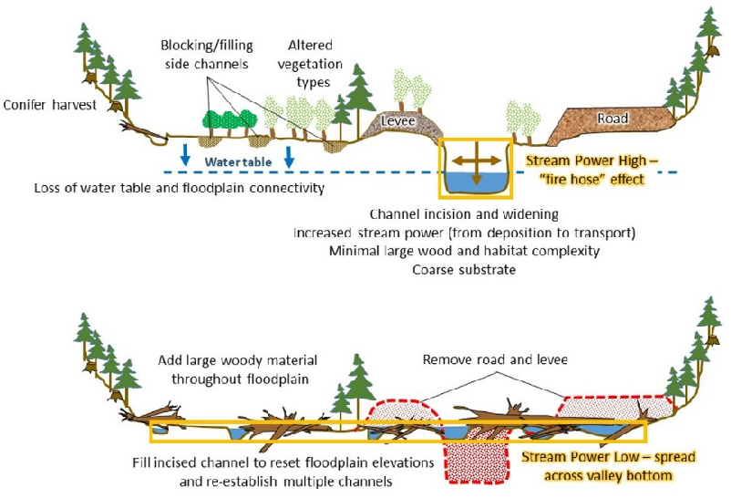
```

<br>

```{r deer-creek-action, fig.cap = 'Before and after restoration took place at Deer Creek, USA. They observed imediate improvements to the habitat and the benefits were self-sustaining (Meyer, 2018).',eval=T}
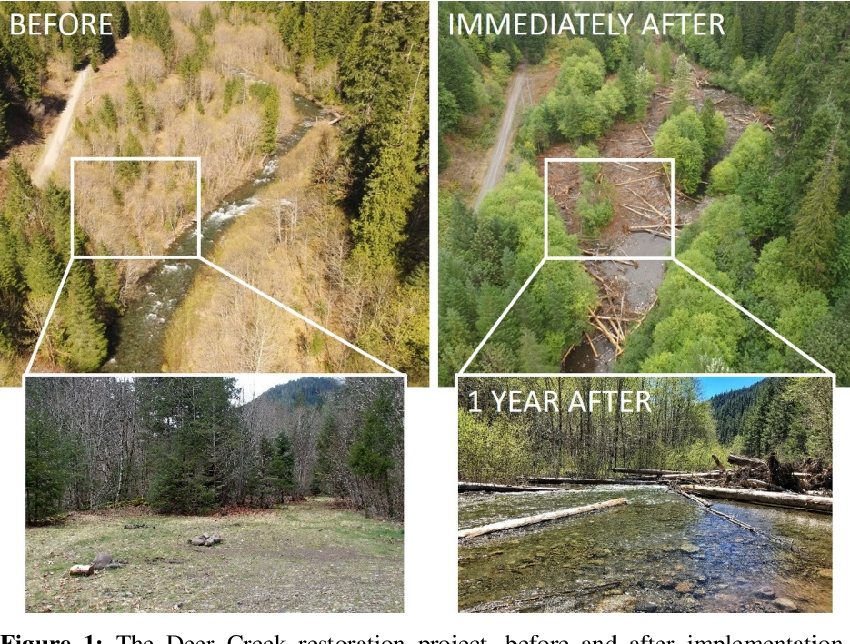
```

Process-based restoration also includes many low-cost and low-tech restoration techniques. Resources are sourced from near-by areas, and the restoration is often done by hand, which makes it more accessible to a broad audience and can be done on a smaller scale [@shahverdian_etal2019Chapter1]. The primary goal of low-tech restoration is to improve the health of as many riverscapes possible by "letting the system do the work" [@shahverdian_etal2019Chapter1].

Low-cost process-based restoration could be an applicable in the Upper Bulkely riverscape. Some examples of low-cost restoration techniques include:

-   Grazing management
-   Riparian planting
-   Post-assisted log structures (PALS)
-   Beaver damn analogs (BDAs)

Further examples of low-cost process-based restoration are available [here](https://lowtechpbr.restoration.usu.edu/workshops/2020/SGI/Modules/module1).


### Stage 0

The Stream Evolution Model (SEM) is used to understanding how the morphology of channels (such as rivers or streams) respond to disturbances like changes in base level, channelization, or alterations in flow and sediment regimes (Figure \@ref(fig:SEM-stages))[@cluer_thorne2014StreamEvolution]. An important features of the SEM is the inclusion of stage 0, which represents the state of the river before disturbances and is categorized as either an anastomosing wet woodland or an anastomosing grassed wetland (Figure \@ref(fig:SEM-stages))[@cluer_thorne2014StreamEvolution].

<br>

```{r SEM-stages, fig.cap = 'Cluer and Thorne’s (2014) stream evolution model which introduced stage 0, a stage that represents the state of the river before disturbances.',eval=T}
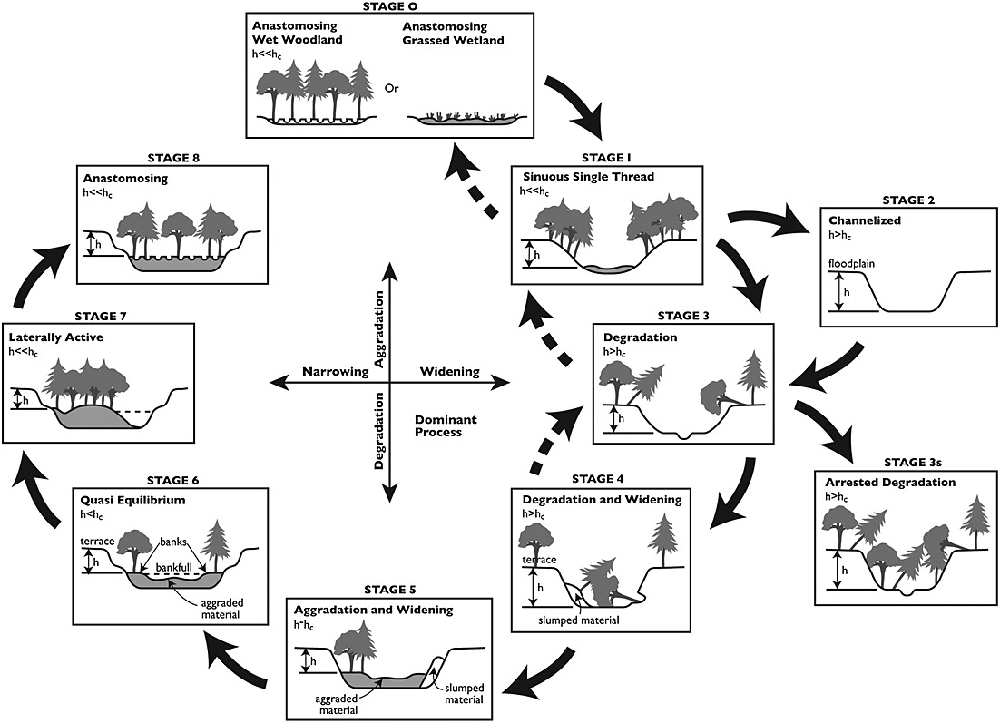
```

<br>

The SEM also assigns a hydrogeomorphic attributes and habitat and ecosystem benefits score to each stage (Figure \@ref(fig:SEM-hab-benifits)). Stage 0 is the ultimate restoration goal, but the SEM suggests that there is a big difference in performance between disconnected and incised streams (stages 3-6) and connected streams (stages 7-1), and that stages 7-1 are the best targets for restoration because they have the highest ecosystem potential (Figure \@ref(fig:SEM-hab-benifits))[@cluer_thorne2014StreamEvolution].
<br>

```{r SEM-hab-benifits, fig.cap = 'Habitat and ecosystem benifits as well as hydrogeomorphic attributes associated with each stage of the SEM, suggesting that stages 7-1 have the highest ecosystem potential (Cluer and Thorne, 2014).',eval=T}
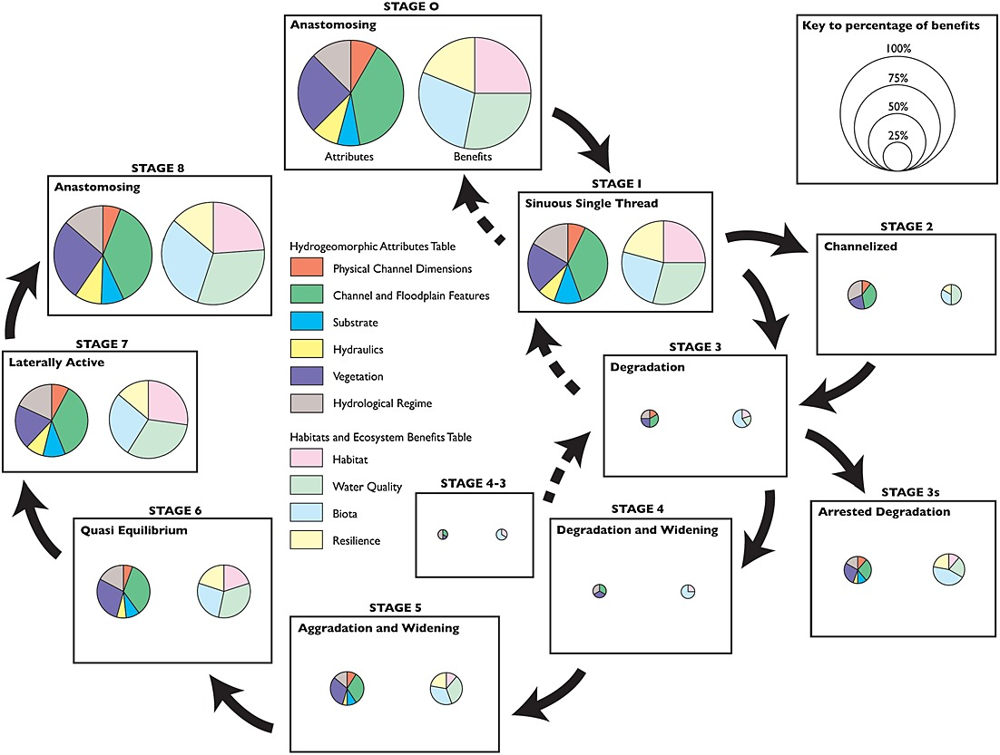
```

<br>

```{r all-benefits, fig.cap = 'Examples of how a stage 0 stream can benifit the entire riverscape and play an important role in the biophysical interactions between organisms (Hauer et al., 2016).',eval=T}
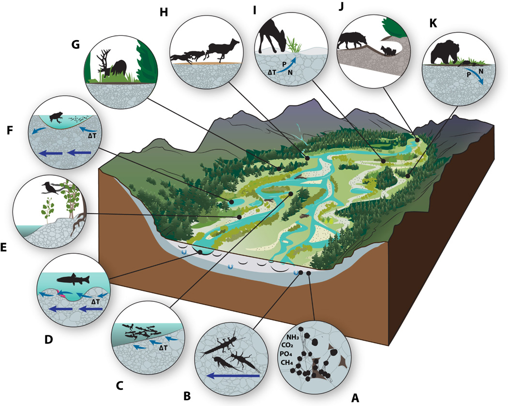
```
