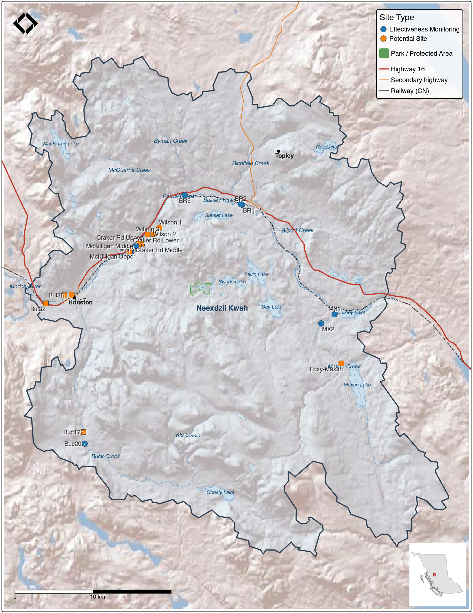

# Results

## Field Assessments

Field site reviews were conducted in 2024 and 2025, with assessments documented at 26 locations. Sites were categorized by visit purpose and restoration status:

**Effectiveness Monitoring Sites (9 assessments):**

-   4 Healthy Watersheds Initiative sites with completed restoration work
-   3 sites with works completed from Wet'suwet'en First Nation restoration planning [@gaboury_smith2016DevelopmentAquatic; @smith_gaboury2016ASBUILTREPORT]
-   1 site with erosion protection completed from @mackay_etal1998MidBulkleyDetailed prescriptions

**Potential Restoration Sites (12 assessments):**


-   4 historic prescription sites from @mackay_etal1998MidBulkleyDetailed where works have not yet been implemented
-   3 prescription locations from @gaboury_smith2016DevelopmentAquatic where works have not yet been implemented
-   4 newly proposed sites identified through landowner engagement (Wilson property, Meints property)
-   1 site adjacent to documented traditional fishing locations [@gottesfeld_rabnett2007SkeenaFish]

**Fraser Erosion Comparison Sites (5 assessments):**

-   5 erosion protection sites on the Lower Chilako River and Kenneth Creek visited to inform Upper Bulkley restoration planning approaches

<br>

```{r fig-map-study-area, fig.cap='Study area map showing sub-basin boundaries and field review site locations within the Neexdzii Kwah (upper Bulkley River) watershed. Sites are classified as effectiveness monitoring (completed restoration works) or potential restoration sites.', out.width="100%"}

```

<br>

UAV flights were conducted at the majority of sites to provide high-resolution baseline imagery for monitoring. Orthomosaics for mapped sites are accessible via the imagery catalog detailed in [Aerial Imagery](#aerial-imagery). Raw field data is stored within the shared QGIS project in the `Project Specific/Field Data/2024` group, with photos in the `ignore_mobile/photos` directory. Site locations are available as a downloadable [`sites_reviewed_2024_202506.geojson`](https://github.com/NewGraphEnvironment/restoration_wedzin_kwa_2024/blob/main/data/gis/sites_reviewed_2024_202506.geojson) which renders as an interactive map on GitHub. Detailed site assessment data including classifications, visit rationale, and assessment comments are provided in [Appendix - Effectiveness Monitoring Data and Potential Restoration Site Review](#app-eff-mon).

<br>

A brief summary of key observations:

-   A recurring theme observed where prescriptions were drafted and/or where work has been completed or proposed was obvious impacts related to riparian/floodplain vegetation removal and damage to sensitive areas due to cattle trampling and cattle waste products.
-   At past sites where investments have been made - there were insignificant widths set aside for riparian/floodplain vegetation restoration/recovery.
-   The protection of road and rail infrastructure through streambank armoring is not adequately incorporating best practices for vegetating riprap, soft armouring where possible and establishing/restoring effective riparian buffers.


### Aquatic Health Monitoring

Benthic invertebrate sampling at three mainstem sites reveals a clear upstream-to-downstream gradient in stream health. Near Houston (BUL-01, immediately upstream of the North Road overpass), the community includes a higher proportion of nutrient-tolerant species — midges (Chironomidae, 24%) and net-spinning caddisflies (Hydropsychidae, 20%) — and the Hilsenhoff Biotic Index (HBI) of 4.14 indicates possible slight organic enrichment, consistent with elevated phosphorus documented in the historical water quality record for this reach. The mid-reach site (BUL-04, Knockholt Bridge) is transitional, with individual samples ranging from near-reference to moderately impaired. The upstream site (BUL-05, below McQuarrie Creek confluence) supports reference-quality conditions — 84% sensitive EPT taxa, 45 taxa total, and an HBI of 2.58 indicating excellent water quality. Statistical testing (PERMANOVA) confirmed these are genuinely different communities.

Compared to previous sampling at the near-Houston reach in 2004 and 2018, the 2025 community shows fewer mayflies and more midges and net-spinning caddisflies — a pattern consistent with increasing nutrient pressure over time. However, sampling season varied across years (August to October), and seasonal differences in invertebrate development could account for some of the observed change.

These results establish a baseline for benthic community condition across the Neexdzii Kwa mainstem. An expanded monitoring network with specific proposed site locations is presented in the [dedicated benthic report](http://www.newgraphenvironment.com/neexdzii_kwa_benthic_2025), along with approximately 50 years of compiled water quality data from 13 provincial monitoring stations.

## Remote Sensing & Imagery

### Aerial Imagery

Orthoimagery has been gathered in the Neexdzii Kwah watershed for past monitoring of historic restoration sites, as part of fish passage restoration planning efforts, and specifically for this project by Matt Sakals (WLRS Provincial Drone Specialist) and New Graph Environment Ltd. team members. Data has been processed and stored as Cloud Optimized GeoTIFFs on AWS, and cataloged using the SpatioTemporal Asset Catalog ([STAC](https://github.com/NewGraphEnvironment/stac_uav_bc)) standard. This means imagery can be queried programmatically based on spatial extent and time range, and loaded directly into applications such as QGIS without needing to know specific file paths — a significant improvement over traditional file-based storage where data is effectively inaccessible unless you already know where it is. Outputs are linked within the collaborative GIS project. A table of download and viewer links is provided in [Appendix - Aerial Imagery](#app-uav-imagery).

#### Historic Aerial Photographs

A collection of 9,741 georeferenced provincial aerial photograph thumbnails (1963–2019) covering the Neexdzii Kwah watershed has been processed and served as a STAC collection (see [Historic Aerial Photographs](#historic-airphotos) in Methods). These photographs are queryable by location and time range alongside the UAV imagery, and are available within the collaborative GIS project. At thumbnail resolution, the collection is sufficient for identifying change trajectories — for example, comparing 1968 riparian conditions against current cleared areas, or documenting the progressive filling of side channels. High-resolution scans of specific photos of interest can be acquired from the province for detailed analysis where the thumbnails reveal compelling change. Details on the georeferencing and processing pipeline are documented in the [`fly`](https://github.com/NewGraphEnvironment/fly) R package and described in [Methods](#historic-airphotos).

### Land Cover Change

```{r lulc-results-summary}
lulc_all <- readRDS(here::here("data", "lulc", "lulc_summary.rds"))
ag_classes <- c("Crops", "Rangeland", "Bare Ground")

lulc_grouped <- lulc_all |>
  dplyr::mutate(
    group = dplyr::case_when(
      class_name == "Trees" ~ "Trees",
      class_name %in% ag_classes ~ "Agriculture",
      TRUE ~ NA_character_
    )
  ) |>
  dplyr::filter(!is.na(group)) |>
  dplyr::group_by(name_basin, year, group) |>
  dplyr::summarize(area = sum(area), .groups = "drop")

lulc_tree_delta <- lulc_grouped |>
  dplyr::filter(year %in% c("2017", "2023"), group == "Trees") |>
  tidyr::pivot_wider(names_from = year, values_from = area) |>
  dplyr::mutate(delta_ha = `2023` - `2017`) |>
  dplyr::arrange(delta_ha)

total_tree_loss <- round(abs(sum(lulc_tree_delta$delta_ha)), 0)
top3 <- head(lulc_tree_delta, 3)

# Gross pixel-level transitions from whole-floodplain rasters
# Use scenario-specific raster dir, fall back to legacy
fp_dir <- here::here("data", "lulc", "rasters", "co_ff04")
if (!dir.exists(fp_dir)) fp_dir <- here::here("data", "lulc", "rasters", "floodplain")

# Trees -> ag: from the saved transition raster (already filtered to from_class=Trees)
trans_freq <- terra::freq(terra::rast(file.path(fp_dir, "transition.tif")))
trans_freq$area_ha <- trans_freq$count * 100 / 1e4
# freq$value is the transition label for factor rasters
gross_trees_to_ag <- trans_freq |>
  dplyr::filter(value %in% c("Trees -> Rangeland", "Trees -> Crops", "Trees -> Bare Ground")) |>
  dplyr::pull(area_ha) |> sum() |> round(0)

# Ag -> trees: need full bidirectional transition
classified_check <- list(
  "2017" = terra::rast(file.path(fp_dir, "classified_2017.tif")),
  "2023" = terra::rast(file.path(fp_dir, "classified_2023.tif"))
)
full_trans <- drift::dft_rast_transition(classified_check, from = "2017", to = "2023")
reverse_to_trees <- full_trans$summary |>
  dplyr::filter(from_class %in% ag_classes, to_class == "Trees") |>
  dplyr::pull(area) |> sum() |> round(0)
net_trees_ag <- gross_trees_to_ag - reverse_to_trees
```

Land cover classification within the modelled floodplain (see [Methods](#time-series-analysis)) shows a consistent pattern of tree cover loss and agriculture expansion between 2017 and 2023. Pixel-level transition analysis identified `r gross_trees_to_ag` ha of floodplain tree cover that converted to agriculture classes (Crops + Rangeland + Bare Ground), while `r reverse_to_trees` ha shifted from agriculture back to trees — a net loss of approximately `r net_trees_ag` ha. The total net tree cover decline across all classes was `r total_tree_loss` ha. The greatest losses occurred in `r top3$name_basin[1]` (`r round(abs(top3$delta_ha[1]), 0)` ha), `r top3$name_basin[2]` (`r round(abs(top3$delta_ha[2]), 0)` ha), and `r top3$name_basin[3]` (`r round(abs(top3$delta_ha[3]), 0)` ha). An interactive map of classified land cover with transition overlays, along with detailed sub-basin summaries, is presented in [Appendix - LULC](#app-lulc).

Not all detected tree loss represents agricultural conversion — some transitions reflect timber harvest within the floodplain, where recent cutblocks are classified as rangeland or bare ground at 10 m resolution. Even where harvested areas regenerate or are replanted, young closed-canopy forests do not provide the same watershed function as mature riparian stands — they contribute less large woody debris, offer less structural diversity for fish habitat, and have different hydrological characteristics. Other pixel-level transitions reflect channel migration, seasonal differences in vegetation health due to drought, or classification noise — particularly along actively shifting reaches and at field-forest edges. Despite these sources of uncertainty, the overall trajectory of floodplain tree cover loss is consistent across sub-basins and time steps, and the magnitude of change is well above what classification error alone would produce. These trends highlight where protection of remaining mature floodplain forest, engagement with landowners, and restoration of degraded reaches may be most effective.

### Climate Anomaly Trends

```{r climate-results-summary}
# Pull key values for inline text
ts <- readr::read_csv(
  here::here("data", "climate", "neexdzii_kwah_anomaly_timeseries.csv"),
  show_col_types = FALSE
)

# Most recent annual tmean anomaly
latest_tmean <- ts |>
  dplyr::filter(par == "tmean", period == "annual") |>
  dplyr::filter(yr == max(yr))

# Count years above normal since 2013
yrs_above <- ts |>
  dplyr::filter(par == "tmean", period == "annual", yr >= 2013, ano > 0) |>
  nrow()
yrs_total <- ts |>
  dplyr::filter(par == "tmean", period == "annual", yr >= 2013) |>
  nrow()

# Recent vs early comparison
recent_tmean <- ts |>
  dplyr::filter(par == "tmean", period == "annual", yr >= 2015) |>
  dplyr::pull(ano) |> mean() |> round(1)
early_tmean <- ts |>
  dplyr::filter(par == "tmean", period == "annual", yr <= 1980) |>
  dplyr::pull(ano) |> mean() |> round(1)
warming_shift <- round(recent_tmean - early_tmean, 1)

recent_summer_tmean <- ts |>
  dplyr::filter(par == "tmean", period == "summer", yr >= 2015) |>
  dplyr::pull(ano) |> mean() |> round(1)
early_summer_tmean <- ts |>
  dplyr::filter(par == "tmean", period == "summer", yr <= 1980) |>
  dplyr::pull(ano) |> mean() |> round(1)
summer_shift <- round(recent_summer_tmean - early_summer_tmean, 1)

# Soil moisture shift
recent_sm <- ts |>
  dplyr::filter(par == "soil_moisture", period == "summer", yr >= 2015) |>
  dplyr::pull(ano) |> mean() |> round(1)
early_sm <- ts |>
  dplyr::filter(par == "soil_moisture", period == "summer", yr <= 1980) |>
  dplyr::pull(ano) |> mean() |> round(1)
sm_shift <- round(recent_sm - early_sm, 1)

sm_below <- ts |>
  dplyr::filter(par == "soil_moisture", period == "summer", yr >= 2000, ano < 0) |>
  nrow()
sm_total <- ts |>
  dplyr::filter(par == "soil_moisture", period == "summer", yr >= 2000) |>
  nrow()
```

The Neexdzii Kwah watershed is approximately `r warming_shift`°C warmer than it was in the mid-20th century. Comparing the last decade (2015–`r latest_tmean$yr`) to the pre-1980 period, mean annual temperature has shifted by `r warming_shift`°C and summers have warmed by `r summer_shift`°C. `r yrs_above` of the last `r yrs_total` years have been warmer than the 1981–2010 average, and these trends are highly statistically significant across all seasons (p < 0.001, Mann-Kendall).

The amount of precipitation has not changed — no season shows a statistically significant trend. However, summer soil moisture has declined by roughly `r abs(sm_shift)` percentage points relative to the pre-1980 period and has been below normal in `r sm_below` of the last `r sm_total` years. Soils are drying because warmer temperatures drive more evapotranspiration, even when the same amount of rain falls. For cold-water fish species, this translates to reduced summer baseflows during the period when flows are already at their lowest, compounding thermal stress from warmer water temperatures.

Trend statistics, spatial anomaly maps, and time series plots are presented in [Appendix - Climate Anomaly Data](#app-climate-anomaly).


## Background Research & Analysis

### Sub-Basin Prioritization

```{r subbasin-summary-prep}
# area_scores loaded in tab-subbasin-desc chunk below — load here for inline text
as <- readr::read_csv(
  here::here("data", "prioritization", "area_scores.csv"),
  show_col_types = FALSE
) |>
  dplyr::mutate(
    tree_loss_fp_pct = round(tree_loss_ha / floodplain_area_ha * 100, 1),
    ag_change_fp_pct = round(ag_change_ha / floodplain_area_ha * 100, 1)
  )

# Top 2 by tree loss as % of floodplain (>10%)
top2 <- as |> dplyr::filter(tree_loss_fp_pct <= -10) |> dplyr::arrange(tree_loss_fp_pct)

# Two largest floodplains below falls (falls_downstream == 0)
fp_below <- as |>
  dplyr::filter(falls_downstream == 0) |>
  dplyr::arrange(dplyr::desc(floodplain_area_ha)) |>
  head(2)
```

Sub-basin boundaries are shown in Figure \@ref(fig:fig-map-study-area). Table \@ref(tab:tab-subbasin-desc-cap) provides an overview of each sub-basin and Table \@ref(tab:tab-area-priority-cap) details land cover change, fish habitat, land ownership, and cultural site metrics. The two largest floodplain areas below the falls barrier limiting salmon distribution are `r fp_below$name_basin[1]` (`r round(fp_below$floodplain_area_ha[1], 0)` ha) and `r fp_below$name_basin[2]` (`r round(fp_below$floodplain_area_ha[2], 0)` ha). Expressed as a percentage of modelled floodplain area, `r top2$name_basin[1]` (`r abs(top2$tree_loss_fp_pct[1])`%) and `r top2$name_basin[2]` (`r abs(top2$tree_loss_fp_pct[2])`%) lost the most floodplain tree cover between 2017 and 2023, with agriculture expansion closely mirroring those losses. These data provide the empirical foundation for the prioritization framework described in [Recommendations](#recommendations), where governance structure and community input guide how investment is directed across sub-basins.

```{r tab-subbasin-desc-cap, results="asis"}
my_caption <- "Sub-basin overview for the Neexdzii Kwah watershed. Fisheries value is rated 1-5 (5 = highest). Floodplain area is modelled using the Valley Confinement Algorithm at flood factor 4 for coho-accessible streams of 3rd order and greater."
my_tab_caption(tip_flag = FALSE)
```

```{r tab-subbasin-desc}
area_scores <- readr::read_csv(
  here::here("data", "prioritization", "area_scores.csv"),
  show_col_types = FALSE
)

area_scores |>
  dplyr::mutate(
    dplyr::across(c(area_km2, floodplain_area_ha), ~ round(.x, 0))
  ) |>
  dplyr::select(
    `Sub-basin` = name_basin,
    `Area (km2)` = area_km2,
    `Floodplain (ha)` = floodplain_area_ha,
    `Fisheries Value` = fisheries_value,
    `Description` = description
  ) |>
  my_dt_table(page_length = 14, cols_freeze_left = 0)
```

```{r tab-area-priority-cap, results="asis"}
my_caption <- "Sub-basin prioritization data for the Neexdzii Kwah watershed. Tree loss and agriculture gain are expressed as percentage of modelled floodplain area (drift land cover classification, 2017-2023). Fish habitat lengths are modelled spawning and rearing from bcfishpass. Non-private floodplain ownership includes Crown Provincial, Untitled Provincial, Crown Agency, Local Government, Federal, and Unclassified parcels from the PMBC parcel fabric. First Nations reserves are from CLAB and cultural sites from @gottesfeld_rabnett2007SkeenaFish. Sub-basins are ordered by floodplain tree loss rate."
my_tab_caption(tip_flag = FALSE)
```

```{r tab-area-priority}
area_scores |>
  dplyr::mutate(
    tree_loss_fp = round(tree_loss_ha / floodplain_area_ha * 100, 1),
    ag_change_fp = round(ag_change_ha / floodplain_area_ha * 100, 1),
    dplyr::across(c(fp_private_ha, fp_crown_ha), ~ round(.x, 0))
  ) |>
  dplyr::arrange(tree_loss_fp) |>
  dplyr::select(
    `Sub-basin` = name_basin,
    `Tree Loss (% FP)` = tree_loss_fp,
    `Ag Gain (% FP)` = ag_change_fp,
    `CO Spawn (km)` = co_spawn_km,
    `CO Rear (km)` = co_rear_km,
    `CH Spawn (km)` = ch_spawn_km,
    `Private FP (ha)` = fp_private_ha,
    `Non-Private FP (ha)` = fp_crown_ha,
    `FN Reserves (ha)` = reserve_area_ha,
    `Cultural Sites` = n_cultural_sites
  ) |>
  my_dt_table(page_length = 14, cols_freeze_left = 0)
```

An initial proof of concept for site-level parameter ranking — using GIS overlay of point locations against fish habitat, land tenure, cultural significance, and disturbance layers — is presented in [Appendix – Example of Potential Restoration Sites Prioritized](#sites-ranked). This approach will gain precision as floodplain type mapping advances and sites that pass through the governance framework's diagnostic gates can be scored against modelled habitat polygons rather than simple point intersections.

### Fish Passage

High priority fish passage restoration opportunities in the Neexdzii Kwah watershed include mulitple culverts on Highway 16 such as Richfield Creek, Johnny David Creek, and Byman Creek along with crossings on private roads, secondary roads and the railway such as Ailport Creek, Perow Creek, tributary to Buck Creek (PSCIS 197640) and Cesford Creek. Some sites have had past work (Johnny David) and others are currently progressing through the design process (trib to Buck) with details presented in the reports below - which are updated intermittently. Of note @irvine_schick2025SkeenaWatershed includes summary tables within the "Results and Discussion" section which detail all sites surveyed since 2020 and link the reader to individual reports and detailed site memos for each site (when available). Additionally, the top priorities within the greater Bulkley River watershed group are ranked numerically within the table includeing Richfield Creek, Ailport Creek, Cesford Creek and Johnny David Creek within the top ten.

-   [Skeena Watershed Fish Passage Restoration Planning 2024](https://www.newgraphenvironment.com/fish_passage_skeena_2024_reporting/)[@irvine_schick2025SkeenaWatershed]
-   [Skeena Watershed Fish Passage Restoration Planning 2023](https://www.newgraphenvironment.com/fish_passage_skeena_2023_reporting/)[@irvine_schick2024SkeenaWatershed]
-   [Bulkley Watershed Fish Passage Restoration Planning 2022](https://www.newgraphenvironment.com/fish_passage_bulkley_2022_reporting/)[@irvine_etal2023BulkleyWatershed]
-   [Bulkley River and Morice River Watershed Groups Fish Passage Restoration Planning 2021](https://www.newgraphenvironment.com/fish_passage_skeena_2021_reporting/)[@irvine2022BulkleyRiver]
-   [Bulkley River and Morice River Watershed Groups Fish Passage Restoration Planning 2020](https://www.newgraphenvironment.com/fish_passage_bulkley_2020_reporting/)[@irvine2021BulkleyRiver]
-   Development Of Aquatic Restoration Designs And On-Farm Cattle Management Improvements within the Wet'suwet'en First Nation Territory [@gaboury_smith2016DevelopmentAquatic]

Lateral connectivity analysis for railway barriers has been run for areas of the Neexdzii Kwah and tributary floodplains using [flooded](https://github.com/NewGraphEnvironment/flooded), with results included as the `lateral_habitat.tif` layer in the shared GIS project. Floodplain extents were modelled using the Valley Confinement Algorithm implemented in flooded, sub-basin delineation was performed with [fresh](https://github.com/NewGraphEnvironment/fresh), and land cover change detection was conducted using [drift](https://github.com/NewGraphEnvironment/drift) — with results presented in [Appendix - LULC](#app-lulc). Future analysis incorporating major roadways (currently under development) will further inform restoration site selection. Additionally, numerous sites proposed for riparian area and erosion protection activities have been identified through local knowledge and landowner engagement and are viewable in the shared GIS project.

## Collaborative Data Management

The shared QGIS project (`restoration_wedzin_kwa`) serves as the spatial integration layer for this work — a single environment where all background information can be viewed together and taken into the field via Mergin Maps on mobile devices. The project contains approximately 45 provincial background layers from the BC Data Catalogue alongside locally generated analysis outputs. Key layer categories include:

-   **Stream network and fish passage modelling** — BC Freshwater Atlas streams, lakes, and wetlands; bcfishpass crossings, barriers, and modelled habitat; PSCIS assessment, design, and remediation sites; fish observations and obstacles to fish passage
-   **Standardized field data collection forms** — site assessment forms (PSCIS, FISS, effectiveness monitoring, eDNA) that sync bidirectionally between field devices and the cloud via Mergin Maps, providing a structured and portable system for data collection
-   **Spatialized historic restoration data** — over 200 riparian prescriptions from @mackay_etal1998MidBulkleyDetailed, floodplain waypoints from @price2014UpperBulkley, and proposed restoration sites from @gaboury_smith2016DevelopmentAquatic, all extracted from PDF reports and georeferenced to the stream network
-   **Traditional knowledge and fisheries values** — traditional fishing sites extracted and spatialized from @gottesfeld_rabnett2007SkeenaFish and @wilson_rabnett2007FishPassage, spatially delineated areas of high value chinook and sockeye spawning habitat (DFO, Arocha Canada, and others), mapped salmon spawning and rearing polygons, and delineation of Wet'suwet'en house group territories
-   **Land and resource tenure** — parcel fabric, range tenures, forest tenure roads, pipeline rights-of-way, Indian Reserves, parks, conservancy areas, wildlife habitat areas, and old growth management areas
-   **Floodplain modelling and land cover change** — modelled floodplain extents, lateral habitat connectivity analysis (railway barriers), and classified land cover change detection polygons highlighting transitions between time periods
-   **Aerial imagery** — UAV orthomosaics, digital surface and terrain models stored as cloud-optimized GeoTIFFs (AWS), and historic orthophoto coverage indices
-   **Environmental context** — biogeoclimatic zones, fire history and burn severity, vegetation resource inventory, terrain and ecosystem mapping, hydrometric stations, environmental monitoring sites, and water rights

The ability to overlay these layers — reach breaks alongside intrinsic potential modelling, fish presence observations next to historic prescriptions, floodplain change detection over current land tenure — allows users to understand the spatial context of each location and make informed decisions about restoration priorities. Critically, this is not just an office tool: through Mergin Maps integration, the full project travels into the field on mobile devices, serving as the primary navigation and orientation system during site visits and providing the platform for standardized data collection in real time.

### Historic Data Products

A key deliverable of this project was the compilation, extraction, and spatialization of historic restoration data from multiple sources. This work involved extracting tabular data from PDF reports, converting site coordinates to spatial formats, and linking descriptions to GIS layers within the shared `restoration_wedzin_kwa` project. Background context for these historic reports is provided in the [Historic Restoration Context](#historic-restoration-context) section. The resulting spatial layers are stored in `sites_restoration.gpkg` within the collaborative GIS project.

Coordinates of points of interest documented in @price2014UpperBulkley — including locations of river channelization, potential barriers to fish migration, and areas of upwelling groundwater — were extracted from the PDF report using `tabulapdf` and converted to a spatial layer. Restoration prescriptions and riparian polygon data from @mackay_etal1998MidBulkleyDetailed were extracted through two complementary workflows: regex parsing of unstructured PDF text to extract 18 fields per prescription, and georeferencing of appendix maps to spatialize riparian polygons using chainage measurements indexed to the BC Freshwater Atlas via `fwapgr`. Site locations from @gaboury_smith2016DevelopmentAquatic have also been extracted and spatialized. Amalgamated results from the SSAF State of the Value Report for Fish and Fish Habitat [@skeenasustainabilityassessmentforum2021Skeenasustainability] have been integrated into the shared GIS project.

Detailed tables of extracted data are provided in [Appendix - Historic Data Products](#app-historic-data).
