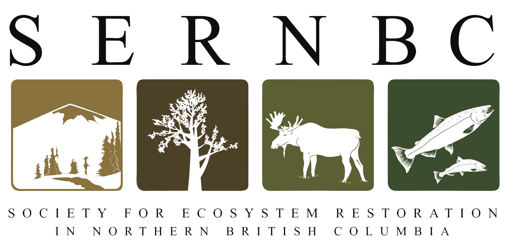

```{r exec-pdf-setup, include=FALSE}
knitr::opts_chunk$set(echo = FALSE, message = FALSE, warning = FALSE)
version <- desc::desc_get_version()
build_date <- format(Sys.Date(), "%Y-%m-%d")
```

<style>
/* Remove blank filler pages between content pages */
.pagedjs_page.pagedjs_blank_page {
  display: none !important;
}
/* Compact references: smaller text, hanging indent, spacing between entries */
#refs .csl-entry {
  font-size: 0.8em;
  padding-left: 2em;
  text-indent: -2em;
  margin-bottom: 0.5em;
}
</style>

<div style="text-align: center; margin-bottom: 0.3em;">

</div>

<div class="version-block" style="text-align: center; margin-bottom: 1em; padding: 0.6em 1em; background: #f5f5f5; border-radius: 4px; font-size: 0.85em; line-height: 1.4;">

**Version `r version` DRAFT** | `r build_date`

[Full Report](`r params$report_url`)

[Source Code and Data](`r params$repo_url`)

[Changelog](`r paste0(params$repo_url, '/blob/main/NEWS.md')`)

*Prepared for the Wet'suwet'en Treaty Office Society*

*Prepared by Al Irvine, R.P.Bio - New Graph Environment Ltd.*  

*on behalf of the Society for Ecosystem Restoration in Northern British Columbia*

</div>

```{r exec-summary, child='0050-executive-summary.Rmd'}
```

<div style="margin-top: 2em; padding-top: 1em; border-top: 1px solid #ccc; font-size: 0.85em;">

This executive summary is extracted from the [full report](`r params$report_url`). The report is a living document — current version, revision history, and open tasks are tracked at the links above.

*Claude Sonnet 4.6 (Anthropic) assisted with literature synthesis, drafting, and technical writing. All scientific interpretation, data analysis, and conclusions are the responsibility of the authors.*

</div>

# References {-}
