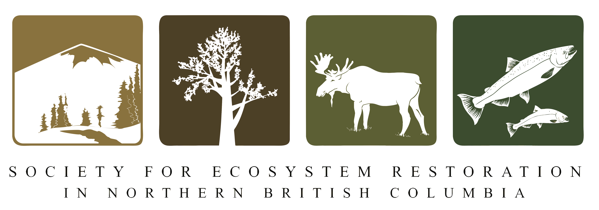

--- 
title: "Neexdzii Kwah Restoration Planning"
author: |
 |
 | Prepared for
 | Wet’suwet’en Treaty Office Society
 |
 |
 | Prepared by
 | Al Irvine, B.Sc., R.P.Bio. and Lucy Schick, B.Sc.
 | New Graph Environment Ltd.
 | on behalf of 
 | Society for Ecosystem Restoration in Northern British Columbia

date: |
 |
 | Version `r desc::desc_get_version()` DRAFT `r format(Sys.Date(), "%Y-%m-%d")`
 |
 | *Claude Opus 4.6 (Anthropic) assisted with analysis, writing, and code development. All scientific interpretation and conclusions are the responsibility of the authors.*
toc-title: Table of Contents
site: bookdown::bookdown_site
output: 
  bookdown::gitbook:
          includes:
            in_header: header.html
params:
  repo_url: 'https://github.com/NewGraphEnvironment/restoration_wedzin_kwa_2024/'
  report_url: 'https://newgraphenvironment.github.io/restoration_wedzin_kwa_2024'
  update_bib: TRUE
  update_packages: FALSE
  update_gis: FALSE
  update_lulc: FALSE
nocite: |
  @gaboury_smith2016DevelopmentAquatic,
  @canada2008CanadianAquatic,
  @wlrs2024BritishColumbia,
  @moe2024BritishColumbia,
  @skeenaknowledgetrustUBRWater,
  @price2014UpperBulkley,
  @oliver2020Analysis2017,
  @ministryofforestsRiparianmanagement,
  @johnston_slaney1996FishHabitat
  
  
documentclass: book
bibliography: "`r if (params$update_bib) { rbbt::bbt_write_bib('references.bib', overwrite = TRUE); 'references.bib' } else 'references.bib'`"
biblio-style: apalike
link-citations: no
github-repo: NewGraphEnvironment/restoration_wedzin_kwa_2024
description: "Restoration Planning for the Neexdzii Kwah (Upper Bulkley River)"
lof: TRUE


---

```{r switch-gitbook-html, echo=FALSE}
gitbook_on <- TRUE
# gitbook_on <- FALSE  ##we just need turn  this on and off to switch between gitbook and pdf via paged.js

```

```{r setup, echo=identical(gitbook_on, TRUE), include = TRUE}
knitr::opts_chunk$set(echo=identical(gitbook_on, TRUE), message=FALSE, warning=FALSE, dpi=60, out.width = "100%")
# knitr::knit_hooks$set(webgl = hook_webgl)
options(scipen=999)
options(knitr.kable.NA = '--') #'--'
options(knitr.kable.NAN = '--')
```

```{r settings-gitbook, eval= gitbook_on}
photo_width <- "100%"
font_set <- 11

```

```{r settings-paged-html, eval= identical(gitbook_on, FALSE)}
photo_width <- "80%"
font_set <- 9
```

```{r settings-gis-update}
gis_update <- FALSE
# gis_update <- TRUE

```


```{r source-files}
source('scripts/packages.R')
source('scripts/functions.R')
source('scripts/tables.R')

```


```{r include=FALSE}
# automatically create a bib database for R packages
knitr::write_bib(c(
  .packages(), 'bookdown', 'knitr', 'rmarkdown'
), 'packages.bib')
```


# Acknowledgement {.front-matter .unnumbered}

We understand our well-being as inseparable from the health of the land and waters we work within. When we care for ecosystems, we care for ourselves.

This work takes place within the Yintah of the Wet'suwet'en people, who have governed these lands and waters through their hereditary house system for thousands of years — through the balhats (feast system), clan-based laws, hereditary leadership, and an oral tradition grounded in accuracy, continuity, and collective memory [@morin2016NiwhtsideniHibiiten]. The Neexdzii Kwa (Upper Bulkley River) and its tributaries sustain ecosystems, wildlife, salmon, and the communities connected to them.

```{js, logo-header, echo = FALSE, eval= T}
title=document.getElementById('header');
title.innerHTML = '<div style="text-align:center"></div>' + title.innerHTML
```

